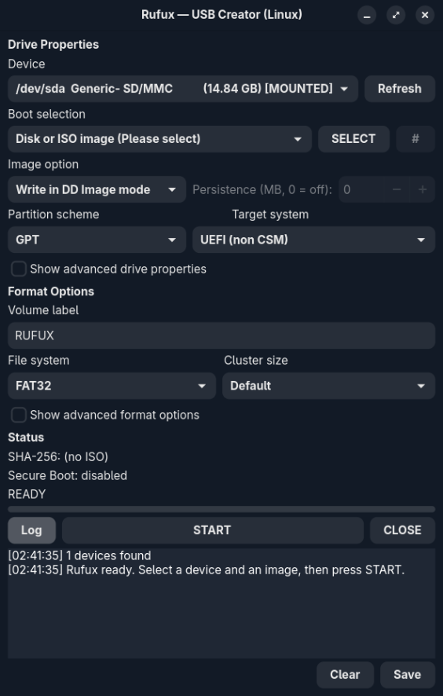

<p align="center">
  
</p>

<h1 align="center">Rufux</h1>

<p align="center">
  Rufus, for Linux. Make bootable USBs without rebooting into Windows.
</p>

<p align="center">
  <a href="https://github.com/Hultwl/Rufux/releases/latest"></a>
  <a href="https://github.com/Hultwl/Rufux/actions/workflows/rufux.yml"></a>
  <a href="https://aur.archlinux.org/packages/rufux-git"></a>
  <a href="https://github.com/Hultwl/Rufux/blob/main/LICENSE.txt"></a>
  
</p>

<p align="center">
  <a href="https://github.com/Hultwl/Rufux/releases/latest/download/Rufux-x86_64.AppImage"><strong>⬇ Download AppImage</strong></a>
</p>

<p align="center">
  
</p>

---

I kept reaching for Rufus and remembering I'm on Linux. `dd` works until
it doesn't (no verification, no partitioning, no persistence, good luck
with Windows ISOs), and the GUI tools each miss something. So I ported
Rufus itself — the Windows sources are in-tree for reference, and
everything Linux-native lives in `src/linux/` + `src/gui/`.

Built with AI assistance, reviewed and tested by a human. Real USB burns,
real bugs found and fixed (one needed a QEMU boot to prove). See
[PORTING.md](PORTING.md) for what's ported, what's not, and why.

## What it does

- **Burn two ways** — raw DD with verify, or file mode (partition, format,
  extract, bootloader) with the drive auto-mounted for you
- **Windows install media** — ESP + NTFS layout, UEFI:NTFS loader, and an
  optional `autounattend.xml` that skips the Win11 hardware checks
- **FreeDOS sticks** — real DOS boot records, not just copied files
- **Fixed VHDs, all four checksums, persistence partitions, bad-block
  passes, Secure Boot status** — the Rufus checklist, minus the parts
  that genuinely can't exist on Linux (documented below)
- **Safety first** — dry-run is the default; real writes need `--real
  --yes` plus root, and fixed disks, mounted targets, and source == target
  are all refused

## Install

**AppImage** (easiest):
```sh
chmod +x Rufux-x86_64.AppImage
./Rufux-x86_64.AppImage   # opens the GUI
```

**Arch:**
```sh
paru -S rufux-git
```

**From source:**
```sh
cmake -B build -DCMAKE_BUILD_TYPE=Release
cmake --build build
ctest --test-dir build   # 4/4 green
sudo cmake --install build
```

You'll need the usual formatting tools on the host (`dosfstools`,
`ntfsprogs`, `exfatprogs`, `e2fsprogs`, `util-linux`, `syslinux`,
`udisks2`, `libarchive`) — full list in
[`packaging/README.md`](packaging/README.md).

## Quick start

```sh
rufux list                                  # what's plugged in
rufux probe image.iso --detail              # label, size, bootable?
rufux write image.iso /dev/sdX --dry-run    # always plan first…
sudo rufux write image.iso /dev/sdX --real --verify --yes
rufux --gui                                 # full GUI, escalates per action
```

## Docs

- [`PORTING.md`](PORTING.md) — kept vs rewritten vs honestly out of scope
- [`PHASES.md`](PHASES.md) — how this got built, phase by phase
- [`CHANGELOG.md`](CHANGELOG.md) — release history
- [`tests/HW_MATRIX.md`](tests/HW_MATRIX.md) — hardware checklist
- `man rufux` after install

## Contributing

Bug reports with log output are gold (there's a Save button in the GUI).
If you touch code, keep `tests/test_phase*.sh` green. For anything that
writes to real hardware, check the HW matrix first.

## Origin

Port of [pbatard/rufus](https://github.com/pbatard/rufus) (© Pete Batard,
GPLv3 — upstream sources kept in-tree for reference). Renamed from Lufus
to Rufux to avoid colliding with
[Hogjects/Lufus](https://github.com/Hogjects/Lufus) — different project,
much respect.
